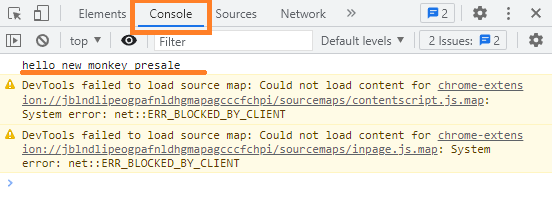
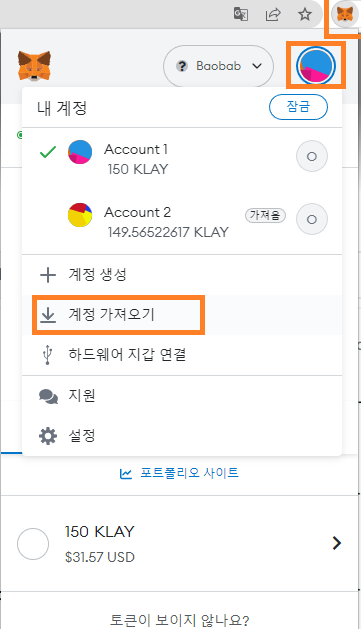
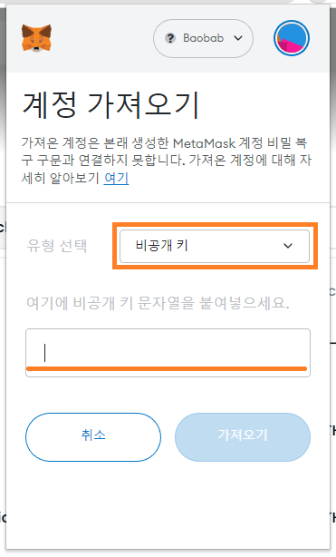
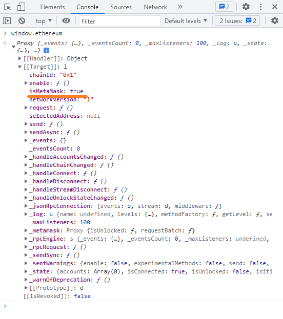

# **Section 10 - Presale - Front-End with Metamask** :spider_web:

# Web Server(lite-server) 만들기

- lite-server는 가벼운 웹 어플리케이션을 만들기 위한 라이브러리입니다.

- /frontend/ 폴더 생성

- 경로 이동

    ```cd frontend```

- npm으로 project 생성

    ```npm init -y```

- lite-server 설치

    ```npm install --save-dev lite-server```

- browserify 설치

    ```npm install --save-dev browserify```

- browserify는 여러 개의 js파일을 하나로 묶어주는 라이브러리입니다.

- web3 설치

    ```npm install --save-dev web3```

- web3는 JavaScript web3입니다. Ethereum관련 개발을 편하게 해주는 코드들이 있고 ehers라는 라이브러리도 있는데 여기서는 web3를 사용해 보겠습니다. 

- lite-server 실행

    ```npx lite-server```

- /frontend/index.html 추가 (파일 이름 변경하시면 안 됩니다.)

    ```html
    <html lang="en">
        <head>
            <style>
            table {
                font-family: arial, sans-serif;
                border-collapse: collapse;
                width: 100%;
            }

            td,
            th {
                border: 1px solid #dddddd;
                text-align: left;
                padding: 8px;
            }

            tr:nth-child(even) {
                background-color: #dddddd;
            }
            </style>

            <meta charset="UTF-8" />
            <title>NewMonkey Presale</title>
        </head>
        <body>
            <h1>Hello</h1>
            <p>Presale page</p>
        </body>
        </html>

    ```

- /frontend/js/ 폴더 생성

- /frontend/js/app.js 파일 추가

    ```js
    (async () => {
        console.log('hello new monkey presale');
    })();
    ```

- package.json scripts 추가

    ```json
    "start": "lite-server",
    "pack": "browserify ./js/app.js -o ./js/bundle.js",
    ```

- /frontend/index.html 파일에서 app.js 파일 로딩하기

    ```
    <script src="js/app.js"></script>
    ```

- npm 으로 lite-server 실행

    ```npm run start```

- Chrome 개발자 도구에서 확인

    

- 실행중인 lite-server 실행중지 (lite-server가 2개 띄워져 있으면 안 됩니다.)

    - Windows : Ctrl + c
    - Mac : Command + c

# Metamask Test 환경 만들기

- 신규 계정 추가하기 (이미 계정이 2개 이상이신 분은 안 하셔도 됩니다.)

    - 새 터미널 열기 (or project root로 이동)

    - 신규 계정 생성

    ```npx hardhat run --network baobab .\src\wallet\create-key.ts```

    - 생성된 계정 Metamask에 추가하기

        - Chrome Metamask Extension 아이콘 클릭
        - 내 계정 아이콘 클릭
        - 계정 가져오기 클릭

            

    - 유형 선택에서 비공개키를 선택
    - Private key(:warning:Mnemonic 아닙니다 :warning:)를 입력하고 가져오기 버턴 클릭

        
    
    - 테스트용 Klay Admin 계정에서 Tester 계정으로 주기

    - 테스트용 Momo 코인 Admin 계정에서 Tester 계정으로 주기
# Metamask 연동

- Chrome 개발자 도구에서 window.ethereum 확인하기

    

    - Metamask가 설치되어 있다면 window.ethereum 오브젝트가 생성됩니다. 이 오브젝트를 이용하여 Metamask와 상호작용할 수 있습니다.

    - 하지만 다른 Wallet도 window.ethereum 오브젝트를 생성하는 경우가 있어 같은 브라우저에 window.ethereum을 사용하는 Wallet이 2개 이상 설치되어 있으면 원하는 대로 동작하지 않습니다.

    - 그래서 이런 경우 둘중에 한 개의 Wallet은 삭제를 하셔야 하고 window.ethereum.isMetaMask라는 변수로 지금 생성되어 있는 window.ethereum 오브젝트가 Metamask가 생성한 오브젝트가 맞는지를 확인하는 변수가 존재합니다.

    - 과거에 Coin98이라는 wallet과 충돌이 있었습니다.


- /fronend/index.html 변경하기

    - UI추가하기
    
    - 스크립트 이름 변경
        
        from
        ```
        <script src="js/app.js"></script>
        ```
        to
        ```
        <script src="js/bundle.js"></script>
        ```

- /fronend/app.js 스크립트 만들기

    - <details><summary>⌨️ Source Code</summary>
    
        ```js
        const Web3 = require('web3');
        const newMonkeyContract = require('../../src/new-monkey/new-monkey.deployed.json');
        const presaleContract = require('../../src/presale/presale.deployed.json');
        const momoContract = require('../../src/momo/momo.deployed.json');

        (async () => {
        let currentAccount = '';

        if (window.ethereum && window.ethereum.isMetaMask == true) {
            console.log('ready metamask');
        } else {
            console.log('no metamask');
        }

        window.ethereum.removeAllListeners();

        function accountsChanged(accounts) {
            console.log('on accountsChanged: ' + JSON.stringify(accounts));

            const selectedAccount = document.getElementById('selectedAccount');
            selectedAccount.innerText = accounts[0];
            currentAccount = accounts[0];
        }

        function chainIdChanged(chainId) {
            console.log('on chainChanged: ' + chainId);

            const selectedChainId = document.getElementById('selectedChainId');
            selectedChainId.innerText = Web3.utils.hexToNumberString(chainId);
        }

        window.ethereum.on('accountsChanged', chainIdChanged);

        window.ethereum.on('chainChanged', chainId => {
            chainIdChanged(chainId);
        });

        window.ethereum.on('connect', connectInfo => {
            console.log('on connect: ' + JSON.stringify(connectInfo));
        });

        window.ethereum.on('disconnect', error => {
            console.log('on disconnect: ' + JSON.stringify(error));
        });

        window.ethereum.on('message', message => {
            console.log('on message: ' + JSON.stringify(message));
        });

        const accounts = await window.ethereum.request({
            method: 'eth_requestAccounts',
        });

        accountsChanged(accounts);

        const chainId = await window.ethereum.request({ method: 'eth_chainId' });

        chainIdChanged(chainId);

        const web3 = new Web3();
        var newMonkey = new web3.eth.Contract(
            newMonkeyContract.abi,
            newMonkeyContract.address,
        );
        const data = newMonkey.methods.balanceOf(currentAccount).encodeABI();

        const balanceOfParam = {
            from: currentAccount,
            to: newMonkeyContract.address,
            data: data,
        };

        const myBalance = await window.ethereum.request({
            method: 'eth_call',
            params: [balanceOfParam],
        });

        const newMonkeyBalance = document.getElementById('newMonkeyBalance');
        newMonkeyBalance.innerText = Web3.utils.hexToNumberString(myBalance);

        const totalSupplydata = newMonkey.methods.totalSupply().encodeABI();

        const totalSupplyParam = {
            from: currentAccount,
            to: newMonkeyContract.address,
            data: totalSupplydata,
        };

        const totalSupply = await window.ethereum.request({
            method: 'eth_call',
            params: [totalSupplyParam],
        });

        const newMonkeyTotalSupply = document.getElementById('newMonkeyTotalSupply');
        newMonkeyTotalSupply.innerText = Web3.utils.hexToNumberString(totalSupply);

        const mintButton = document.getElementById('mintButton');
        mintButton.onclick = async function mint() {
            const web3 = new Web3();

            var momo = new web3.eth.Contract(momoContract.abi, momoContract.address);

            const allowanceData = momo.methods
            .allowance(currentAccount, presaleContract.address)
            .encodeABI();

            const allowanceParam = {
            from: currentAccount,
            to: momoContract.address,
            data: allowanceData,
            };

            const allowance = await window.ethereum.request({
            method: 'eth_call',
            params: [allowanceParam],
            });

            if (Web3.utils.hexToNumberString(allowance) == '0') {
            const approveData = momo.methods
                .approve(
                presaleContract.address,
                '0xffffffffffffffffffffffffffffffffffffffffffffffffffffffffffffffff',
                )
                .encodeABI();

            const approveParam = {
                from: currentAccount,
                to: momoContract.address,
                gasLimit: Web3.utils.toHex('5000000'),
                gasPrice: Web3.utils.toHex(Web3.utils.toWei('750', 'gwei')),
                value: Web3.utils.toHex('0'),
                data: approveData,
            };

            await window.ethereum.request({
                method: 'eth_sendTransaction',
                params: [approveParam],
            });

            return;
            }

            var presale = new web3.eth.Contract(
            presaleContract.abi,
            presaleContract.address,
            );

            const data = presale.methods.buy('front').encodeABI();

            const param = {
            from: currentAccount,
            to: presaleContract.address,
            gasLimit: Web3.utils.toHex('5000000'),
            gasPrice: Web3.utils.toHex(Web3.utils.toWei('750', 'gwei')),
            value: Web3.utils.toHex('0'),
            data: data,
            };

            const transactionHash = await window.ethereum.request({
            method: 'eth_sendTransaction',
            params: [param],
            });

            const txHash = document.getElementById('txHash');
            txHash.innerText = transactionHash;
        };
        })();


        ```
    
    </details>

- /fronend/index.html 만들기

    - <details><summary>⌨️ Source Code</summary>
    
        ```html
        <html lang="en">
        <head>
            <style>
            table {
                font-family: arial, sans-serif;
                border-collapse: collapse;
                width: 100%;
            }

            td,
            th {
                border: 1px solid #dddddd;
                text-align: left;
                padding: 8px;
            }

            tr:nth-child(even) {
                background-color: #dddddd;
            }
            </style>

            <meta charset="UTF-8" />
            <title>NewMonkey Presale</title>
        </head>
        <body>
            <h1>Hello</h1>
            <p>Presale page</p>

            <table>
            <tr>
                <td>selected account</td>
                <td id="selectedAccount"></td>
            </tr>
            <tr>
                <td>selected chainid</td>
                <td id="selectedChainId"></td>
            </tr>
            <tr>
                <td>My NewMonkey balance</td>
                <td id="newMonkeyBalance"></td>
            </tr>
            <tr>
                <td>Total Supply</td>
                <td id="newMonkeyTotalSupply"></td>
            </tr>
            <tr>
                <td>Mint</td>
                <td><button id="mintButton">Mint</button></td>
            </tr>
            <tr>
                <td>TX Hash</td>
                <td id="txHash"></td>
            </tr>
            </table>
            <script src="js/bundle.js"></script>
        </body>
        </html>


        ```
    
    </details>

- ```npm run pack```

- Metamask로 이벤트 확인하기

- Metamask로 UI 확인하기

- Metamask로 Minting하기 

- :warning: 웹페이지를 2개를 띄우면 트랜잭션창도 2개가 만들어집니다. 하나는 닫도록 합시다.