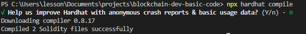
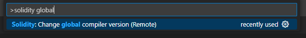
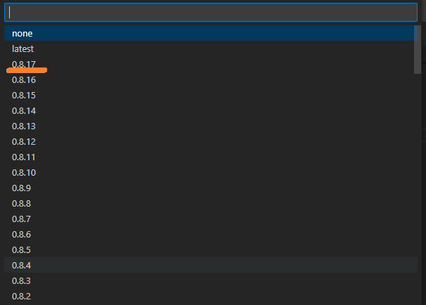

# **Section 3 - Smart Contract 만들기** :rocket:

# Solidity 소개

- Solidity는 Smart Contract를 작성하기 위한 객체지향 언어입니다

- Solidity 최신 버전은 현재 0.8.17입니다.

- Solidity의 각 버전은 차이점이 존재하고 구버전의 코드는 최신버전에서 Compile 되지 않을 가능성이 있습니다.
  
- 예) 0.7.x Version의 Solidity(Smart Contract) 파일은 0.8.x Version에서 Compile 되지 않을 수 있습니다.

- 인터넷에서 찾은 과거 버전의 코드가 여러분이 사용하는 최신버전에서는 작동하지 않거나 다르게 동작할 가능성이 있어 구체적으로 Version을 명시하지 않은 자료는 꼭 테스트 코드를 작성하여 확인이 필요합니다.

# sol 파일 기본 구조 소개

- 예제 컨트랙트 추가하기
  
    - contracts 폴더추가
     
    - Greeting.sol 파일 추가
  
        ```solidity
        //SPDX-License-Identifier: MIT

        pragma solidity 0.8.17;

        import "hardhat/console.sol";

        contract Greeter {
            string private _greeting;
            
            constructor(string memory greeting_) {
                console.log("Deploying a Greeter with greeting:", greeting_);
                _greeting = greeting_;
            }

            function greet() public view returns (string memory) {
                return _greeting;
            }
                
            function setGreeting(string memory greeting_) public {
                console.log("Changing greeting from '%s' to '%s'", _greeting, greeting_);
                _greeting = greeting_;
            }
        }
        ```
- 살펴보기
  
    - [SPDX-License-Identifier](https://spdx.org/licenses/)

    - solidity version

    - import

    - contract

# Greeter.sol Compile

- Compile
    
    ```npx hardhat compile```
  
    

- Solidity version 설정

    - (Window) Ctrl + Shift + p
  
    - (Mac) Cmd + Shift + p

    
    
    - 0.8.17 버전 선택

    

- artifacts\contracts\Greeter.sol\Greeter.json 확인하기
    - Application Binary Interface(abi)
    - bytecode & deployedBytecode

# EOA, CA

- EVM 호환네트워크에서 주소는 2가지 Externally-owned Account (EOA), Contract Account(CA)가 있습니다.
    - EVM : Ethereum Virtual Machine, 여러 컴퓨터로 이루어진 이더리움 가상 머신입니다. 우리가 만든 Contract가 이 환경에서 실행됩니다.

    - EVM 호환 네트워크 (EVM Compatible Network) : EVM과 호환이 가능한 네트워크들입니다. 간단하게 설명하면 solidity를 사용하여 Smart Contract를 개발하고 배포하고 상호작용하는 코드들이 동일하게 작동하는 네트워크들입니다. Binance Smart Chain, Fantom, Polygon, Avalanche, Cardano, Tron, Klaytn 등이 있습니다. 
      
    - EVM 네트워크 이전 및 확장 시 고려할 점: Solidity를 사용하지만 그 이외의 코드들은 호환되지 않는 네트워크도 있고 전부 호환가능한 네트워크들도 있어서 EVM 호환네트워크이라고 소개되지만 가지고 있는 코드로 서비스를 이전이나 확장하기 어려운 네트워크도 있기에 다른 네트워크로의 배포가 얼마나 용이한지는 살펴봐야 합니다.
  
- EOA는 보통 사람들이 말하는 계정을 말합니다. 메타마스크나 다른 유틸리티등을 이용하여 만든 계정들이 이 계정입니다.

- CA는 Contract의 주소입니다. 이 주소는 Contract를 배포하면 할당되며 이 주소를 이용하여 우리는 Contract와 Interaction 할 수 있습니다.

# eth_call, eth_sendTransaction

- 변수를 read만 하는 view 함수, 변수에 write를 하는 non view가 있습니다.

- non view 함수는 Transaction을 발생시킵니다.

    - Transaction : 여러개 의 작업을 하나로 묶은 단위입니다. 트랜잭션이라고 말할 수 있는 작업 묶음은 반드시 모두가 성공하거나 모두가 실패하게 됩니다. 예를 들어 은행에서 예금을 이체할 때 내 잔고는 원하는 만큼 마이너스가 돼야 하고 상대방 잔고는 그만큼 플러스가 돼야 하는데 둘 중에 한 가지의 작업만 완료되면 큰 사고로 이어지게 되는데 이때 트랜잭션을 사용하여 2가지 작업 묶음 모두 성공하거나 한 가지가 실패했을 때 모두 실패하게 되어 무결성을 보장해 줍니다.

- view 함수와 none view 함수는 EOA에서 함수를 호출하는 방법이 다릅니다. view 함수는 ```eth_call```(Ethereum JSON-RPC API)를 사용하고 none view 함수는 ```eth_sendTransaction``` Method를 사용합니다. 

- ```eth_call```은 가스비가 필요하지 않고 eth_sendTransaction 가스비가 필요합니다.

    - 가스비 (gas fee) : 컨트랙트에 write가 가능한 함수(non view 함수)들을 호출할 때는 Transaction을 네트워크에 보내어 채굴자가 채굴함으로 나의 트랜잭션이 실행될 수 있습니다. 이때 트랜잭션을 보낸 EOA는 가스비를 지불하고 채굴자는 가스비의 일부를 보상으로 받게 됩니다.

- eth_call은 채굴과정이 필요하지 않아 바로 결과값을 받을 수 있습니다.

- eth_sendTransaction은 가스비를 지불하며 Transaction을 전송하고 채굴자(Miner)가 채굴해 주기를 기다려야 합니다.

- Hardhat을 사용하면 위 명령어는 직접 사용하지 않지만 어떻게 다른지는 알아야 합니다. Metamask와 연동하는 강의(강의 마지막 부분)에서 다시 나옵니다.

# Greeter.sol 기능 확장하기

- <details><summary>⌨️ Source Code</summary>
    
    ```solidity
    //SPDX-License-Identifier: MIT

    pragma solidity 0.8.17;

    import "hardhat/console.sol";

    contract Greeter {
        address private _owner;

        string private _greeting;
        bool private _callSetGreeting;
        string[] private _greetingHistory;

        mapping(address => uint256) public balances;

        event SetGreeting(address sender, string oldGreeting, string newGreeting);

        constructor(string memory greeting_) {
            console.log("Deploying a Greeter with greeting:", greeting_);

            _setGreetingPrivate(msg.sender, greeting_);
            _owner = msg.sender;
        }

        function setGreetingPayable(string memory greeting_) public payable {
            require(msg.value == 0.1 ether, "msg.value is not 0.1 ether");

            balances[msg.sender] += msg.value;

            _setGreetingPrivate(msg.sender, greeting_);
        }

        function withdraw(address to) public payable {
            require(_owner == msg.sender, "only owner");

            address thisAddress = address(this);
            console.log("contract balance: %d", thisAddress.balance);
            bool result = payable(to).send(thisAddress.balance);
            require(result, "Failed to send Ether");
        }
        
        function setGreeting(string memory greeting_) public {
            _setGreetingPrivate(msg.sender, greeting_);
        }

        function getGreet() public view returns (string memory) {
            return _greeting;
        }

        function getGreetingHistoryCount() public view returns (uint256) {
            return _greetingHistory.length;
        }

        function getGreetingHistoryAll() public view returns (string[] memory) {
            return _greetingHistory;
        }

        function getGreetingHistoryOne(uint256 index) public view returns (string memory) {
            return _greetingHistory[index];
        }

        function _setGreetingPrivate(address sender, string memory greeting_) private {
            console.log("Changing greeting from '%s' to '%s'", _greeting, greeting_);

            if (_callSetGreeting == false) {
                _callSetGreeting = true;
            }

            string[] storage greetingHistory = _getGreetingHistory();
            greetingHistory.push(_greeting);

            emit SetGreeting(sender, _greeting, greeting_);

            _greeting = greeting_;
        }

        function _getGreetingHistory() private view returns (string[] storage) {
            return _greetingHistory;
        }
    }
    ```
    </details>
- Contract 멤버변수

    - bool, string, uint256, array, mapping
  
        - private 변수는 abi에 해당변수를 참조할 수 있는 interface가 존재하지 않으므로 컨트랙트 외부(EOA 혹은 CA)에서 참조할 수 없습니다.

        - 하지만 private변수의 값을 가져오는 함수가 아예 없는 것은 아닙니다. ```getStorageAt``` 함수로 private변수라도 값을 볼 수 있습니다.

        - 그러므로 private 변수에 비밀 데이타를 저장하면 안 됩니다.

    - storage, memory

        - storage는 영구적으로 저장되는 데이타이고 memory는 특정 scope를 벗어나면 사라지는 데이타입니다.

        - Contract의 멤버 변수는 storage에 저장되고 함수의 Parameter는 memory에 저장됩니다.

- Contract 멤버함수

    - public view, public, private view, private
        
        - private함수는 Contract 내부에서 가능하고 외부에서 호출할 수 없고 public 함수는 내부, 외부에서 호출할 수 있습니다.

    - payable, require

        - $Ether을 전송하는 코드를 실행하는 함수는 payable 키워드를 넣어야 합니다.

        - require문을 넣어 필요한 조건을 체크하고 충족하지 않을 시 transaction을 revert시킬 수 있습니다.
        
            - revert : 트랜잭션을 실행될 때 실행하는 모든 코드는 모두 실패로 만들 수 있습니다. 이미 여러 코드를 실행하였다고 하여도 코드 마지막에 revert를 시키면 모든 코드가 실행되지 않은 상태로 돌릴 수 있습니다. 이는 블럭체인 원리와 연관이 있으며 revert가 되었다고 해도 사용된 가스비는 돌려받지 못합니다.
- event

    - EOA가 Contract의 non view 함수를 호출할 때는 returns 값을 받을 수 없습니다.

    - event로 로그를 남겨서 수행된 트랜잭션의 특정값들을 받아볼 수 있습니다.

    - 특정 Contract에서 다른 컨트랙트의 non view 함수를 호출할 때는 returns의 값을 받을 수 있습니다.

- Compile
    
    ```npx hardhat compile```

- Greeter.json 확인


