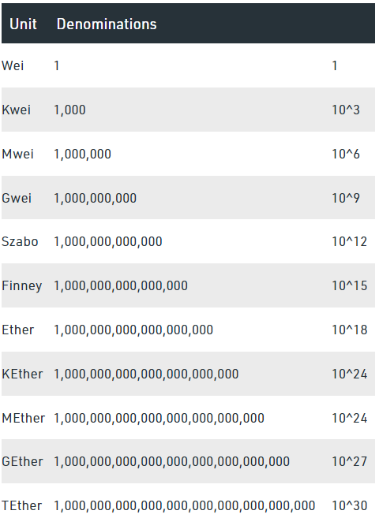

# **Section 4 - Unit Test 만들기** :yum:

# Unit Test 소개

- Unit Test는 한글로 단위테스트라고 부릅니다.

- 내가 만든 코드를 단위별로 나누어 의도한대로 동작하는지 검증하는 코드입니다.

- Hardhat에는 Hardhat Network라는 내장된 네트워크가 있습니다. Unit Test를 실행하면 자동으로 내 컴퓨터에 이 네트워크가 실행되고 테스트 코드는 이 네트워크에서 실행됩니다.

- 그러므로 Unit Test는 언제든지 실행가능하고 외부에 의존하지 않고 수행할 수 있습니다.

# Unit Test 기본 구조

- UnitTest Template 파일 추가

    - test 폴더 추가
    
    - Unit Test 파일 추가 (Basic.test.ts)
        
        ```ts
        import { expect } from 'chai';

        describe('Basic', () => {
            before(() => {
                console.log('execute before');
            });

            beforeEach(() => {
                console.log('execute beforeEach');
            });

            it('test', () => {
                console.log('execute test');
            });

            it('test2 ', () => {
                console.log('execute test2');

                const str = 'mo mo mo';
                const strArray = str.split(' ');
                expect(strArray.length).to.be.equal(3);

                expect(strArray[0]).to.be.equal('mo');
                expect(strArray[1]).to.be.equal('mo');
                expect(strArray[2]).to.be.equal('mo');
            });
        });

        ```

    - 유닛테스트 실행
        ```
        npx hardhat test .\test\Basic.test.ts
        ```
# Typechain 파일 만들기

- hardhat.config.ts에 hardhat-typechain import 추가
    ```
    import 'hardhat-typechain';
    ```

- ```npx hardhat typechain```

- typechain 폴더 살펴보기

# UnitTest를 만들기전에 알아야 할것

- JavaScript와 TypeScript의 관계

    - TypeScript는 ts-node를 이용하여 컴파일 없이(겉에서 보기에는) 실행이 가능합니다.

    - 하지만 내부적으로는 TypeScript는 컴파일을 하여 실행이 되는거고 컴파일을 하면 JavaScript코드가 만들어집니다.

    - JavaScript의 후진점으로 인해서 TypeScript가 등장하게 되었고 TypeScript를 쓰면 신경써야될(이 강의에서는 없습니다) 부분이 더 생기지만 개발시에는 JavaScript보다 훨씬 낫다는데는 다들 이견이 없으실겁니다.

- async/await 간단한 설명

    - NodeJS에서 함수 호출할때 2가지 방식이 있습니다. 한가지는 동기 다른 한가지는 비동기 방식입니다.

    - 함수 하나가 실행시간이 오래 걸릴때 (보통은 네트워크 IO, 파일관련 함수들) NodeJS는 별도의 Thread에서 이 작업을 완료하고 Main Thread에서 결과를 받아 코드를 이어서 수행할 수 있도록 합니다.

    - 복잡한 개념이니 그냥 듣고 잊으셔도 됩니다.

    - 동기 함수 호출예
    
        ```ts
        const [admin, other] = waffle.provider.getWallets();
        ```
    
    - 비동기 함수 호출예
        ```ts
        greeter = (await waffle.deployContract(admin, GreeterArtifact, [initMsg])) as Greeter;
        ```

    - 다른 점은 비동기 함수는 함수 호출할때 await 이라는 keyword를 넣습니다.

    - 그럼 await을 붙여야 할지 말아야 할지는 어떻게 알수 있는가? 함수 선언할때 async 키워드가 있으면 await을 넣어주세요. 혹은 함수의 return값이 Promise<???> 이면 await을 붙여주세요.

    - 그래도 혹시 실수로 await을 안 넣었다면??? eslint가 찾아줍니다.


# Greeter.sol Unit Test 만들기

- hardhat.config.ts에 hardhat-typechain import 추가
    ```
    import '@nomiclabs/hardhat-waffle';
    ```

- 파일 추가 /test/Greeter.test.ts

- 테스트 코드 만들기

    - <details><summary>⌨️ Source Code</summary>
    
        ```ts
        import { expect } from 'chai';
        import { ethers, waffle } from 'hardhat';
        import GreeterArtifact from '../artifacts/contracts/Greeter.sol/Greeter.json';
        import { Greeter } from '../typechain';

        describe('Greeter', () => {
            let greeter: Greeter;
            const initMsg = 'hello blockchain!!!';

            const [admin, other0, other1, other2, receiver] =
                waffle.provider.getWallets();

            before(async () => {});

            beforeEach(async () => {
                greeter = (await waffle.deployContract(admin, GreeterArtifact, [
                initMsg,
                ])) as Greeter;
            });

            it('constructor', async () => {
                const greetMsg = await greeter.getGreet();
                expect(greetMsg).to.be.equal(initMsg);
            });

            it('setGreeting', async () => {
                const secondMsg = 'second greeting msg';

                await greeter.setGreeting(secondMsg);
                const recvMsg = await greeter.getGreet();
                expect(recvMsg).to.be.equal(secondMsg);
            });

            it('setGreeting with event', async () => {
                const secondMsg = 'second greeting msg';

                const transaction = await greeter.setGreeting(secondMsg);
                const receipt = await transaction.wait();

                const event = receipt.events?.filter(x => {
                return x.event == 'SetGreeting';
                })[0];

                expect(event?.args?.sender).to.be.equal(admin.address);
                expect(event?.args?.oldGreeting).to.be.equal(initMsg);
                expect(event?.args?.newGreeting).to.be.equal(secondMsg);

                const thirdMsg = 'third greeting msg';
                await expect(greeter.setGreeting(thirdMsg))
                .to.emit(greeter, 'SetGreeting')
                .withArgs(admin.address, secondMsg, thirdMsg);
            });

            it('getGreetingHistory', async () => {
                const secondMsg = 'second greeting msg';

                const transaction = await greeter.setGreeting(secondMsg);
                const receipt = await transaction.wait();

                const thirdMsg = 'third greeting msg';
                await expect(greeter.setGreeting(thirdMsg))
                .to.emit(greeter, 'SetGreeting')
                .withArgs(admin.address, secondMsg, thirdMsg);

                const count = await greeter.getGreetingHistoryCount();
                expect(count).to.be.equal(3);

                const historyAll = await greeter.getGreetingHistoryAll();
                expect(historyAll.length).to.be.equal(3);
                expect(historyAll[0]).to.be.equal('');
                expect(historyAll[1]).to.be.equal(initMsg);
                expect(historyAll[2]).to.be.equal(secondMsg);

                const secondHistory = await greeter.getGreetingHistoryOne(1);
                expect(secondHistory).to.be.equal(initMsg);

                await expect(greeter.getGreetingHistoryOne(3)).to.reverted;
            });

            it('setGreetingPayable', async () => {
                const secondMsg = 'second greeting msg';

                await expect(greeter.setGreetingPayable(secondMsg)).to.reverted;
                await expect(greeter.setGreetingPayable(secondMsg)).to.revertedWith(
                'msg.value is not 0.1 ether',
                );

                await expect(
                greeter.setGreetingPayable(secondMsg, {
                    value: ethers.utils.parseUnits('0.09', 'ether'),
                }),
                ).to.revertedWith('msg.value is not 0.1 ether');

                await expect(
                greeter.setGreetingPayable(secondMsg, {
                    value: ethers.utils.parseUnits('0.11', 'ether'),
                }),
                ).to.revertedWith('msg.value is not 0.1 ether');

                await greeter.setGreetingPayable(secondMsg, {
                value: ethers.utils.parseUnits('0.1', 'ether'),
                });

                const recvMsg = await greeter.getGreet();
                expect(recvMsg).to.be.equal(secondMsg);
            });

            it('withdraw', async () => {
                const secondMsg = 'second greeting msg';

                const oldContractEther = await waffle.provider.getBalance(greeter.address);

                expect(oldContractEther).to.be.equal(ethers.utils.parseUnits('0', 'ether'));

                await greeter.connect(other0).setGreetingPayable(secondMsg, {
                value: ethers.utils.parseUnits('0.1', 'ether'),
                });
                await greeter.connect(other0).setGreetingPayable(secondMsg, {
                value: ethers.utils.parseUnits('0.1', 'ether'),
                });

                await greeter.connect(other1).setGreetingPayable(secondMsg, {
                value: ethers.utils.parseUnits('0.1', 'ether'),
                });
                await greeter.connect(other2).setGreetingPayable(secondMsg, {
                value: ethers.utils.parseUnits('0.1', 'ether'),
                });

                const newContractEther = await waffle.provider.getBalance(greeter.address);
                expect(newContractEther).to.be.equal(
                ethers.utils.parseUnits('0.4', 'ether'),
                );

                const other0Balance = await greeter.balances(other0.address);
                const other1Balance = await greeter.balances(other1.address);
                const other2Balance = await greeter.balances(other2.address);

                expect(other0Balance).to.be.equal(ethers.utils.parseUnits('0.2', 'ether'));
                expect(other1Balance).to.be.equal(ethers.utils.parseUnits('0.1', 'ether'));
                expect(other2Balance).to.be.equal(ethers.utils.parseUnits('0.1', 'ether'));

                const oldReceiverEther = await waffle.provider.getBalance(receiver.address);

                await expect(
                greeter.connect(other0).withdraw(receiver.address),
                ).to.revertedWith('only owner');

                await greeter.withdraw(receiver.address);
                const newReceiverEther = await waffle.provider.getBalance(receiver.address);

                expect(newReceiverEther.sub(oldReceiverEther)).to.be.equal(
                ethers.utils.parseUnits('0.4', 'ether'),
                );

                const lastContractEther = await waffle.provider.getBalance(greeter.address);
                expect(lastContractEther).to.be.equal(
                ethers.utils.parseUnits('0', 'ether'),
                );
            });
        });
        ```

    </details>

    - contract deploy

    - constructor

    - setGreeting

    - setGreeting with event

    - getGreetingHistory

    - Ether 단위 설명
  
        
  
    - setGreetingPayable

    - withdraw