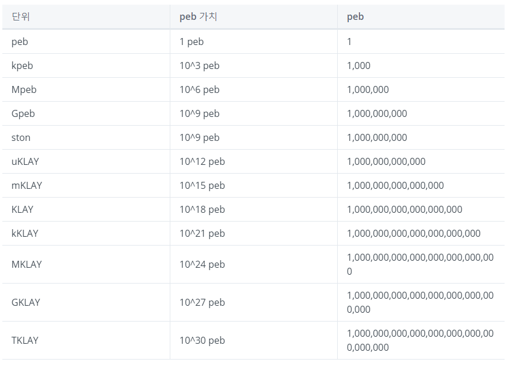
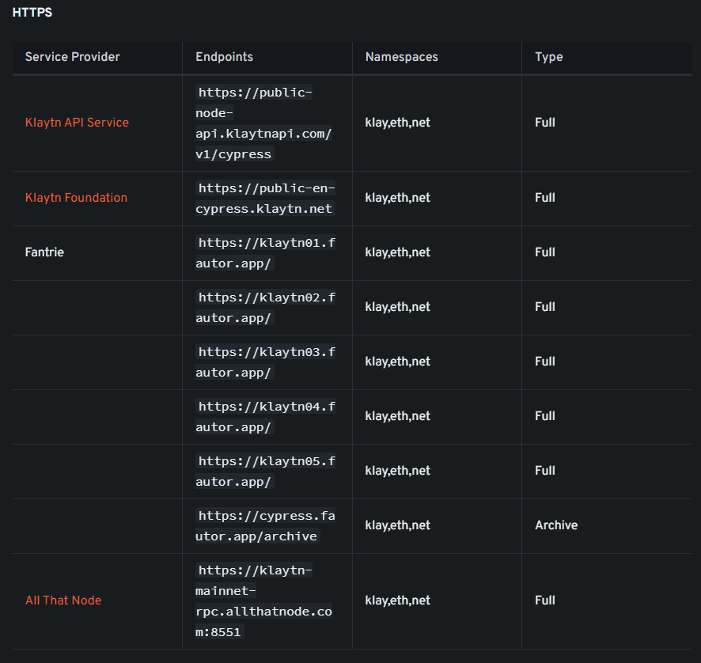
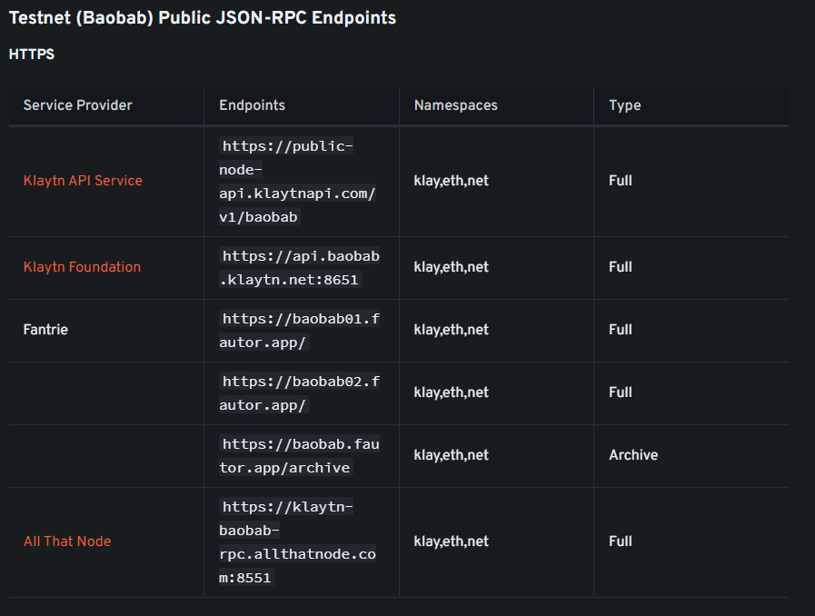
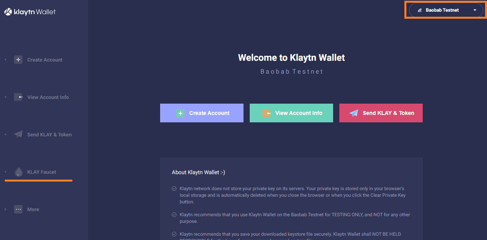
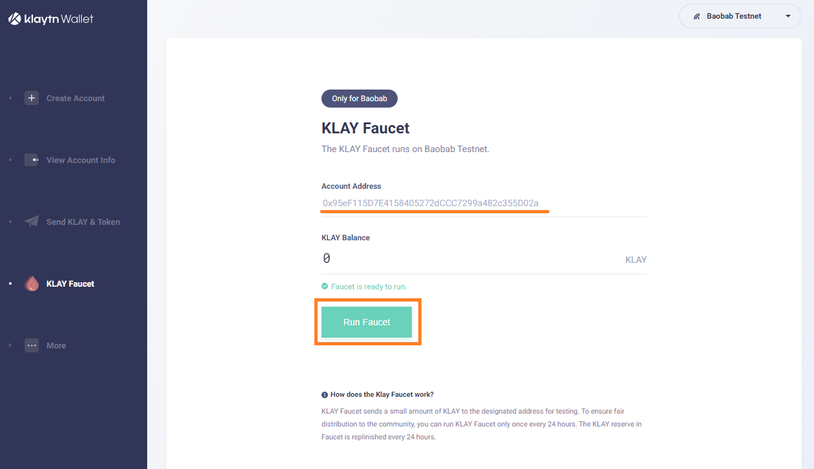
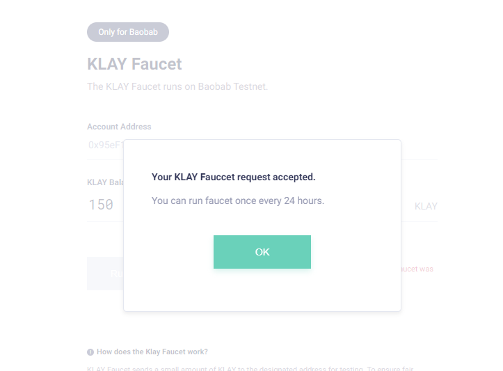

# **Section 5 - Smart Contract with Klaytn** :spider_web:

# Klaytn network 소개

- Klaytn은 EVM 호환 네트워크입니다.

- testnet의 이름은 baobab이고 mainnet의 이름은 cypress입니다.

- 가스비가 적고 테스트 네트워크에서 테스트하기 충분한 가스비용 Klaytn을 받을 수 있습니다.
  
- Klaytn Units
    
    

- Gas fee(가스비) = Gas Used * Gas Price

- Klaytn Gas Price = 25 gwei ~ 750 gwei

- Gas Price를 올린다고 먼저 채굴되지는 않습니다.

- 트랜잭션을 보낼 때 Gas Price를 설정해서 보내야 하는데 권장 가스비를 가져와서 2를 곱한 수를 설정(Gas Price가 변경되어 트랜잭션 실패가 나는 걸 방지하기 위해)하도록 추천되고 있지만 편의상 750 gwei를 넣겠습니다. 750 gwei를 넣어도 현재 필요한 Gas Price를 사용하도록 되어 있습니다.


# EOA 생성

- /src/wallet 폴더 생성

- /src/wallet/create-key.ts 파일 추가

- create-key.ts 스크립트 만들기
    - <details><summary>⌨️ Source Code</summary>
    
        ```ts
        import { ethers } from 'hardhat';

        const wallet = ethers.Wallet.createRandom();
        console.log('address:', wallet.address);
        console.log('mnemonic:', wallet.mnemonic.phrase);
        console.log('privateKey:', wallet.privateKey);
        ```
    
    </details>

- 스크립트 실행
 
    ```npx hardhat run .\src\wallet\create-key.ts```

- 스크립트 결과
  
    ```
    address: 0x95eF115D7E4158405272dCCC7299a482c355D02a
    mnemonic: ugly state venture detect bullet situate tobacco put size zero olive ostrich
    privateKey: 0x9daf48c23c0432f21c31b0772ff5ba552e7229316e82ffe25b3f3731ebe4cee9
    ```

- :warning:강의 자료에 있는 키를 쓰지 마시고 직접 만들어서 쓰시기 바랍니다. 충분히 많은 baobab klaytn이 있지만 여러 사람이 같이 사용하면 언젠가 바닥나서 강의 진행이 어려울 겁니다. :bow:
   
# .env

- OS에는 환경변수란게 있습니다. 여러 프로그램들이 공통으로 사용할 특정 값들이 저장되어 있다고 생각하시면 됩니다.

- .env 파일은 내가 실행할 스크립트에만 적용될 환경변수를 넣는 파일입니다.

- 이 파일에는 보통 id/pw나 DB의 주소 같은 실행할 환경마다 달라져야 되는 값들을 넣습니다. (Test Machine과 Live Machine은 서로 DB를 바라보고 있어야 하기 때문입니다. :smiley:)

- .env 파일 추가

- hardhat.config.ts에 dotenv import 추가
    
    ```
    import 'dotenv/config';
    ```

- .env_sample 파일 추가

# hardhat.config.ts

- 원하는 network과 통신하기 위해 RPC서버라는게 필요합니다. RPC서버는 End Point라고도 부릅니다.

- 모든 사람에게 오픈되어 있는 RPC 서버를 public 서버, 오픈되어 있지 않은 RPC 서버를 private 서버라고 합니다.

- cypress public endpoint

    

- baobab public endpoint

    

    
- baobab network 추가
    ```
    baobab: {
        url: "https://klaytn-baobab.blockpi.network/v1/rpc/public",
        accounts: [process.env.PRIVATE_KEY || ""],
        chainId: 1001
    }
    ```
- :warning: 현재(2023-04-13) AllthatNode EndPoint가 올바르게 동작하지 않습니다.!!! 강의 노트에 있는 BlockPi EndPoint를 이용해주세요~

- :warning: 혹시 미래에 이 EndPoint도 문제가 있으면 다른 EndPoint로 시도해 보시기 바랍니다.

# Deploy Greeter to Klaytn
		
- Deploy 스크립트 만들기
    - /src/utils 폴더생성

    - gas.ts 파일 추가

    - gas.ts 스크립트 만들기
        - <details><summary>⌨️ Source Code</summary>
            
            ```ts
            import { ethers } from 'hardhat';

            export function getGasOption(chainId: number) {
                if (chainId == 1001 || chainId == 8217) {
                    return {
                        gasLimit: 5000000,
                        gasPrice: ethers.utils.parseUnits('750', 'gwei'),
                    };
                } else {
                    throw new Error('unknown chainId ' + chainId);
                }
            }
            ```

        </details>
        
    - /src/greeter 폴더 생성

    - deploy.ts 파일 추가
        
    - deploy 스크립트 만들기
        - <details><summary>⌨️ Source Code</summary>
    
            ```ts
            import hre, { ethers } from 'hardhat';
            import GreeterArtifact from '../../artifacts/contracts/Greeter.sol/Greeter.json';
            import { getGasOption } from '../utils/gas';
            import * as fs from 'fs';

            async function main() {
                const [admin] = await hre.ethers.getSigners();

                const chainId = hre.network.config.chainId || 0;

                const factory = await ethers.getContractFactory(GreeterArtifact.contractName);
                const contract = await factory.deploy('first message', getGasOption(chainId));
                const receipt = await contract.deployTransaction.wait();

                const deployedContract = {
                    address: contract.address,
                    blockNumber: receipt.blockNumber,
                    chainId: hre.network.config.chainId,
                    abi: GreeterArtifact.abi,
                };

                const filename = __dirname + `/greeter.deployed.json`;

                const deployedContractJson = JSON.stringify(deployedContract, null, 2);
                fs.writeFileSync(filename, deployedContractJson, {
                    flag: 'w',
                    encoding: 'utf8',
                });

                console.log(deployedContractJson);
            }

            main()
            .then(() => process.exit(0))
            .catch(error => {
                console.error(error);
                process.exit(1);
            });
            ```

        </details>

    - Unit Test와 다른 점 - ```wait()```
  
- klaytn faucet - baobab klaytn 받기

    - https://baobab.wallet.klaytn.foundation/ 열기 혹은 구글에서 klaytn wallet으로 검색

        

    - 오른쪽 상단에 Baobab Testnet으로 안되어 있으면 Baobab으로 변경

    - 왼쪽 하단에 Klay Faucet 클릭!

    - 나의 public key를 입력하고 하단에 Run Faucet 클릭
            
        

    - Klaytn 수량이 올라가면 성공! :smiley:

        

    - 24시간에 한번만 가능합니다.
  
- deploy 스크립트 실행
    
    ```
    npx hardhat run --network baobab .\src\greeter\deploy.ts
    ```

- Klaytn scope에서 확인

    - Block, From, To, Nonce

    - Gas Price, Effective Gas Price, Gas Used, Gas Limit, TX Fee

    - bytecode와 배포된 bytecode 비교하기
  
# Interaction with Smart Contract

- Interaction 스크립트 만들기

    - /src/greeter/interaction.ts 파일 추가

    - interaction.ts 스크립트 만들기
        - <details><summary>⌨️ Source Code</summary>

            ```ts
            import hre, { ethers } from 'hardhat';
            import { getGasOption } from '../utils/gas';
            import * as fs from 'fs';
            import { Greeter } from '../../typechain';

            async function main() {
                const [admin] = await hre.ethers.getSigners();
                const chainId = hre.network.config.chainId || 0;

                const deployedGreeterJson = fs.readFileSync(
                    __dirname + '/greeter.deployed.json',
                    'utf-8',
                );
                const deployedGreeter = JSON.parse(deployedGreeterJson);
                const greeter = (await ethers.getContractAt(
                    deployedGreeter.abi,
                    deployedGreeter.address,
                )) as Greeter;

                const gasOption = getGasOption(chainId);
                const option = {
                    gasLimit: gasOption.gasLimit,
                    gasPrice: gasOption.gasPrice,
                    value: ethers.utils.parseUnits('100', 'finney'),
                };

                let transaction = await greeter.setGreetingPayable(
                    'setGreetingPayable msg',
                    option,
                );
                await transaction.wait();

                transaction = await greeter.setGreeting('setGreeting msg', gasOption);
                await transaction.wait();

                const greetingMsg = await greeter.getGreet();

                console.log('greetingMsg: ' + greetingMsg);

                const historyCount = await greeter.getGreetingHistoryCount();

                console.log('historyCount: ' + historyCount);

                const historyAll = await greeter.getGreetingHistoryAll();

                console.log('historyAll: ' + JSON.stringify(historyAll));

                const firstHistory = await greeter.getGreetingHistoryOne(0);
                console.log('firstHistory: ' + firstHistory);

                const secondHistory = await greeter.getGreetingHistoryOne(1);
                console.log('secondtHistory: ' + secondHistory);

                transaction = await greeter.withdraw(admin.address, getGasOption(chainId));
                await transaction.wait();
            }

            main()
            .then(() => process.exit(0))
            .catch(error => {
                console.error(error);
                process.exit(1);
            });
            ```

        </details>
    
    - interaction.ts 실행

        ```
        npx hardhat run --network baobab .\src\greeter\interaction.ts
        ```

    - /src/greeter/estimate-gas.ts 파일 추가

    - estimate-gas.ts 스크립트 만들기
        - <details><summary>⌨️ Source Code</summary>
        
            ```ts
            import hre, { ethers } from 'hardhat';
            import { getGasOption } from '../utils/gas';
            import * as fs from 'fs';
            import { Greeter } from '../../typechain';

            async function main() {
                const [admin] = await hre.ethers.getSigners();
                const chainId = hre.network.config.chainId || 0;

                const deployedGreeterJson = fs.readFileSync(
                    __dirname + '/greeter.deployed.json',
                    'utf-8',
                );
                const deployedGreeter = JSON.parse(deployedGreeterJson);
                const greeter = (await ethers.getContractAt(
                    deployedGreeter.abi,
                    deployedGreeter.address,
                )) as Greeter;

                const estimateGas = await greeter.estimateGas.setGreeting('setGreeting msg');
                console.log(estimateGas);
            }

            main()
            .then(() => process.exit(0))
            .catch(error => {
                console.error(error);
                process.exit(1);
            });

            ```

        </details>

    - estimate-gas.ts 실행

        ```
        npx hardhat run --network baobab .\src\greeter\estimate-gas.ts
        ```

- Klaytn scope에서 확인

    - Amount, Method, Method Signature

    - Event Logs

    - Input Data

- Method Signature 만들기
    
    - /src/greeter/get-method-signatures.ts 추가

    - get-method-signatures.ts 스크립트 만들기
        - <details><summary>⌨️ Source Code</summary>
        
            ```ts
            import hre, { ethers } from 'hardhat';
            import { getGasOption } from '../utils/gas';
            import * as fs from 'fs';
            import { Greeter } from '../../typechain';

            async function main() {
                const [admin] = await hre.ethers.getSigners();
                const chainId = hre.network.config.chainId || 0;

                const deployedGreeterJson = fs.readFileSync(
                    __dirname + '/greeter.deployed.json',
                    'utf-8',
                );
                const deployedGreeter = JSON.parse(deployedGreeterJson);
                const greeter = (await ethers.getContractAt(
                    deployedGreeter.abi,
                    deployedGreeter.address,
                )) as Greeter;

                const keys = Object.keys(greeter.functions);

                console.log(
                    '======================== methods start ========================',
                );

                for (let i = 0; i < keys.length; i++) {
                    if (keys[i].includes('(') == true) {
                    const encodedMethodName = ethers.utils.keccak256(
                        ethers.utils.toUtf8Bytes(keys[i]),
                    );

                    console.log(`${keys[i]} : ${encodedMethodName}`);
                    }
                }

                console.log('======================== methods end ========================');
            }

            main()
            .then(() => process.exit(0))
            .catch(error => {
                console.error(error);
                process.exit(1);
            });

            ```
        
        </details>

    - get-method-signatures.ts 실행
    
        ```
        npx hardhat run --network baobab .\src\greeter\get-method-signatures.ts
        ```