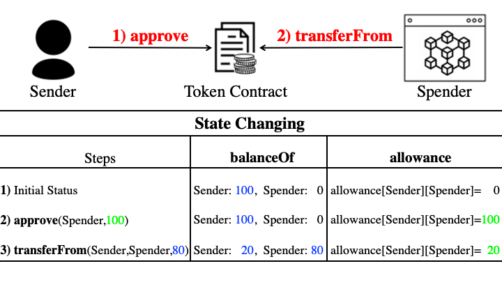

# **Section 6 - ERC20** :moneybag:


# 기본통화 vs ERC20

- 코인은 어떤 기준으로 나누어 보면 기본통화와 ERC20코인으로 나눌수 있습니다. Ethereum, Polygon, Klaytn과 같은 그 네트웍의 기본 통화가 있고 Sandbox, Playdapp, Bora, Axie Infinity와 같은 ERC20 코인이 있습니다.

- 서로 다루는 법이 다르며 우리는 이전 시간에 네트웍의 기본통화를 다루어 봤고 이제 ERC20을 다루는 법을 알아보려 합니다.


# OpenZeppelin 소개

- OpenZeppelin은 블록체인 및 소프트웨어 개발 회사입니다. 또한 이 회사에서 만든 Smart Contract 표준 프레임웍입니다. 보통 OpenZeppelin을 말하면 이 표준 프레임웍을 얘기합니다. 유용한 Smart Contract들의 모음이라고 생각하시면 됩니다.

- OpenZepplin은 보안감사(Audit)를 거쳐 코드의 무결성이 검증되어 있습니다. 여러분들이 만든 ERC20 코인을 거래소에 상장할 때 Audit은 필수입니다.

- 내가 원하는 기능을 구현하기에 좋은 자료가 되기도 합니다.

- 구글링을 하시면 많은 컨트랙트들이 Github에 오픈되어 있습니다. 개발하시기 전에 참조하시면 많은 도움이 되실 거라 생각합니다.


# ERC20 소개

- ERC-20은 Ethereum Request for Comment 20의 약자입니다. 20은 리퀘스트 숫자다. 이더리움 네트워크의 개선안을 제안하는 EIPs(Ethereum Improvement Proposals)에서 관리하는 공식 프로토콜(규약)입니다.

- ERC20 규약을 지켜야 내가 만든 코인이 널리 사용될 수 있습니다. (예 : MetaMask 코인전송)
  
- openzeppelin ERC20폴더를 찾습니다. (/node_modules/@openzeppelin/contracts/token/ERC20)

- IERC20.sol 살펴보기

    - Contract를 상속받으면 하위 Contract(상속받은 Contract)는 상위 Contract의 모든 변수와 함수를 가지게 됩니다.
  
    - 새로운 키워드 internal, external은 private, public과 유사합니다. 다만 internal은 Contract 내부와 하위 Contract에서 호출이 가능하고 external은 Contract 내부에서는 호출할 수 없고 외부에서만 호출이 가능합니다.

    - function totalSupply() external view returns (uint256);
        - 총 유통량

    - function balanceOf(address account) external view returns (uint256);
        - 특정 유저의 잔액
  
    - function transfer(address to, uint256 amount) external returns (bool);
        - 내 코인 전송

    - function allowance(address owner, address spender) external view returns (uint256);
        - spender에게 허가된 apporve 총량

    - function approve(address spender, uint256 amount) external returns (bool);
        - spender에게 원하는 양만큼 허가
        - approve 함수를 호출할 때 역시 가스비를 지불해야 하기 때문에 편의상 아주 큰 수를 서비스를 처음 이용할 때 한 번만 approve하곤 합니다.
        
    - function transferFrom(address from, address to, uint256 amount) external returns (bool);
        - 제 3자가 코인 전송

    - 그림으로 알아보기
        
        
        
        출처 : https://blocksecteam.medium.com/unlimited-approval-in-erc20-convenience-or-security-1c8dce421ed7

- ERC20.sol 살펴보기
  
# ERC20 내 코인 만들기

- /contracts/Momo.sol 파일 추가

- Momo.sol 만들기

    - <details><summary>⌨️ Source Code</summary>

        ```solidity
        //SPDX-License-Identifier: MIT

        pragma solidity 0.8.17;

        import "@openzeppelin/contracts/token/ERC20/ERC20.sol";
        import "hardhat/console.sol";

        contract Momo is ERC20 {
            constructor(string memory name, string memory symbol, uint256 initial) ERC20(name, symbol) {
                _mint(msg.sender, initial);
            }
        }

        ```

    </details>

- Typechain 만들기
    ```
    npx hardhat typechain
    ```

# Momo Coin UnitTest 만들기

- /test/Momo.test.ts 파일 추가

- Momo.test.test 스크립트 만들기

    - <details><summary>⌨️ Source Code</summary>
        
        ```ts
        import { expect } from 'chai';
        import { ethers, waffle } from 'hardhat';
        import MomoArtifact from '../artifacts/contracts/Momo.sol/Momo.json';
        import { Momo } from '../typechain';

        describe('Momo', () => {
            let momo: Momo;
            const initial = ethers.utils.parseUnits('1000000000', 'ether');

            const [admin, other0, other1, other2, receiver] =
                waffle.provider.getWallets();

            before(async () => {});

            beforeEach(async () => {
                momo = (await waffle.deployContract(admin, MomoArtifact, [
                'Momo',
                'Mom',
                initial,
                ])) as Momo;
            });

            it('constructor', async () => {
                const totalSupply = await momo.totalSupply();
                expect(totalSupply).to.be.equal(initial);
                const balance = await momo.balanceOf(admin.address);
                expect(balance).to.be.equal(initial);
            });
        });

        ```
    
    </details>

- Unit Test 실행
    ```
    npx hardhat test .\test\momo.test.ts
    ```

# Deploy Momo Coin to Klaytn

- /src/momo 폴더추가

- /src/momo/deploy.ts 파일 추가

- deploy.ts 스크립트 만들기

    - <details><summary>⌨️ Source Code</summary>
        
        ```ts
        import hre, { ethers } from 'hardhat';
        import MomoArtifact from '../../artifacts/contracts/Momo.sol/Momo.json';
        import { getGasOption } from '../utils/gas';
        import * as fs from 'fs';

        async function main() {
            const [admin] = await hre.ethers.getSigners();

            const chainId = hre.network.config.chainId || 0;

            const factory = await ethers.getContractFactory(MomoArtifact.contractName);
            const contract = await factory.deploy(
                'Momo',
                'Mom',
                ethers.utils.parseUnits('1000000000', 'ether'),
                getGasOption(chainId),
            );

            const receipt = await contract.deployTransaction.wait();

            const deployedContract = {
                address: contract.address,
                blockNumber: receipt.blockNumber,
                chainId: hre.network.config.chainId,
                abi: MomoArtifact.abi,
            };

            const filename = __dirname + `/momo.deployed.json`;

            const deployedContractJson = JSON.stringify(deployedContract, null, 2);
            fs.writeFileSync(filename, deployedContractJson, {
                flag: 'w',
                encoding: 'utf8',
            });

            console.log(deployedContractJson);
        }

        main()
        .then(() => process.exit(0))
        .catch(error => {
            console.error(error);
            process.exit(1);
        });

        ```
    
    </details>

- deploy.ts 실행
    ```
    npx hardhat run --network baobab .\src\momo\deploy.ts
    ```


# Momo Coin Balance 가져오기

- /src/momo/get-balance.ts 파일 추가

- get-balance.ts 스크립트 만들기

    - <details><summary>⌨️ Source Code</summary>
    
        ```ts
        import hre, { ethers } from 'hardhat';
        import { getGasOption } from '../utils/gas';
        import * as fs from 'fs';
        import { Momo } from '../../typechain';

        async function main() {
            const [admin] = await hre.ethers.getSigners();

            const chainId = hre.network.config.chainId || 0;

            const deployedContractJson = fs.readFileSync(
                __dirname + '/momo.deployed.json',
                'utf-8',
            );
            const deployedContract = JSON.parse(deployedContractJson);
            const momo = (await ethers.getContractAt(
                deployedContract.abi,
                deployedContract.address,
            )) as Momo;

            const adminBalance = await momo.balanceOf(admin.address);

            console.log(adminBalance);
            console.log(ethers.utils.formatEther(adminBalance));
        }

        main()
        .then(() => process.exit(0))
        .catch(error => {
            console.error(error);
            process.exit(1);
        });

        ```
    
    </details>

- get-balance.ts 실행
    ```
    npx hardhat run --network baobab .\src\momo\get-balance.ts
    ```