# **Section 8 - Opensea** :boat:

- :warning: Opensea, Metamask는 크게 변경되지 않는 서비스입니다. 하지만 미래에 서비스 변경으로 강의 내용과 맞지 않을 수 있습니다.

- :warning: 이미 Metamask를 사용하셨던 분이거나 Opensea를 이용해 보신 분들은 강의 내용과 조금 다른 스텝을 만날 수 있습니다. 

- :warning: 강의자료를 만드는 과정에서 여러 번 테스트를 진행하면서 처음 진행하시는 분과 다른 스텝이 될 수도 있습니다.

- :smiley: 하지만 어떤 화면이 나오시던지 예나 다음, 수락등의 긍정적인 버턴을 누르시면 문제없이 넘어가실 수 있습니다. 

# Opensea & Metamask 소개

- Opensea
    
    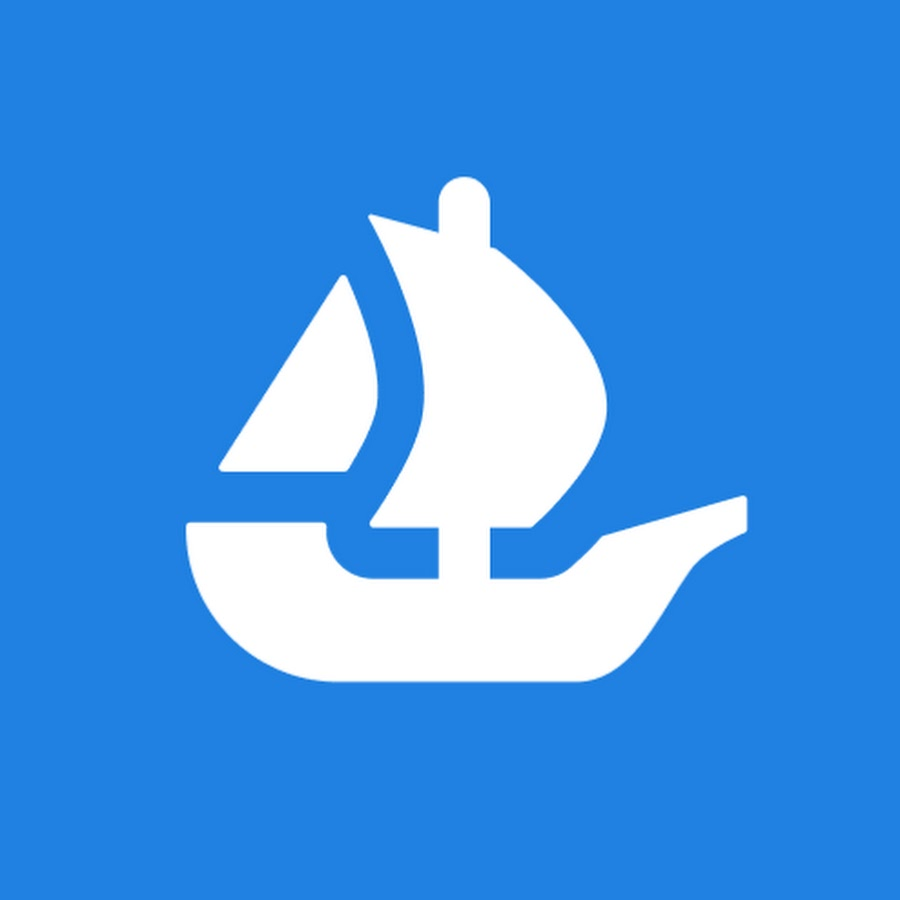

    - Opensea는 NFT 거래를 지원하는 마켓입니다. 현재(2023-02-01) Ethereum, Polygon, Klaytn, Solana, Arbitrum, Optimism, Avalanche, BNB 네트워크를 지원하고 있습니다.

    - 가장 유명한 NFT 마켓 플레이스 (하지만 Blur.io 출현)


- Metamask
    - Metamask는 Wallet입니다. EOA를 생성 및 관리하고 특정 서비스를 이용할 때 Metamask가 서명 및 API 호출을 담당해 줍니다.
    - 나 <-> FrontEnd <-> ***Metamask*** <-> Network
    - 많은 EVM 호환네트워크에서 운영되는 프로젝트들은 모두 Metamask를 기본으로 연동해 주고 있으니 이 Wallet을 이용하여 Opensea를 이용하겠습니다.

    - PC와 Mobile을 지원하고 있고 여기서는 PC버전을 다루겠습니다.

    - Metamask는 여러 브라우저를 지원하지만 여기서는 크롬을 사용하겠습니다.

# Metamask 설치

- Chrome Metamask Extension을 설치해 보겠습니다.

- 크롬에서 [Metamask Download](https://metamask.io/download/) 페이지로 이동

- Install MetaMask for Chrome 클릭!
  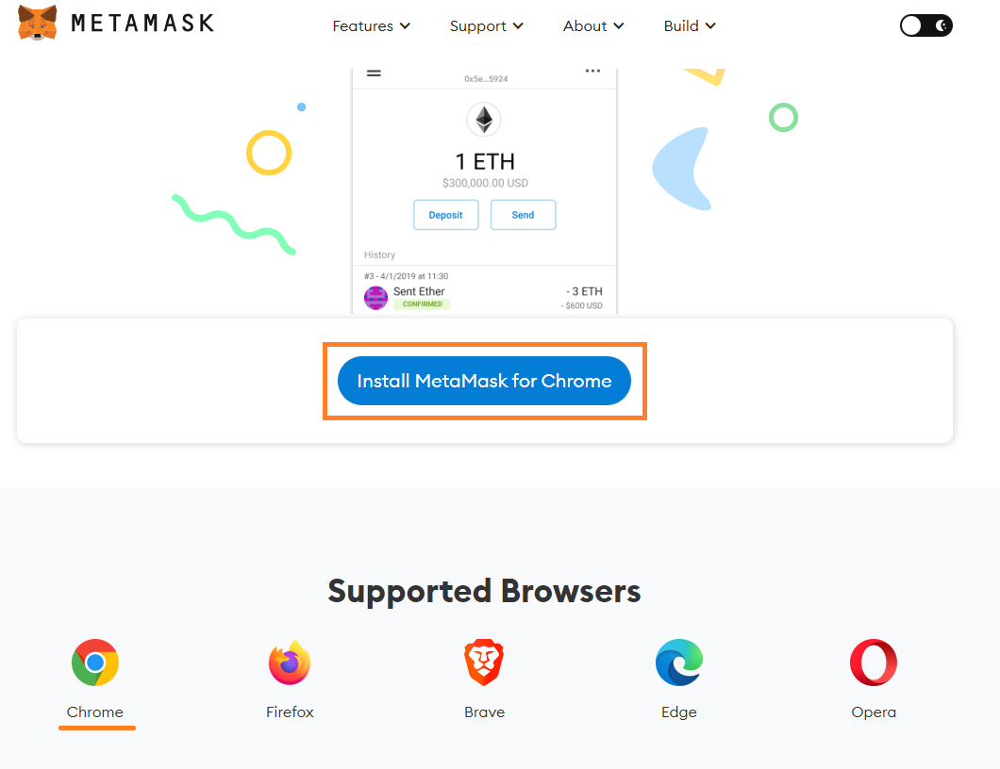

- Chrome에 추가 버턴 클릭 -> 확장 프로그램 추가 버턴 클릭
  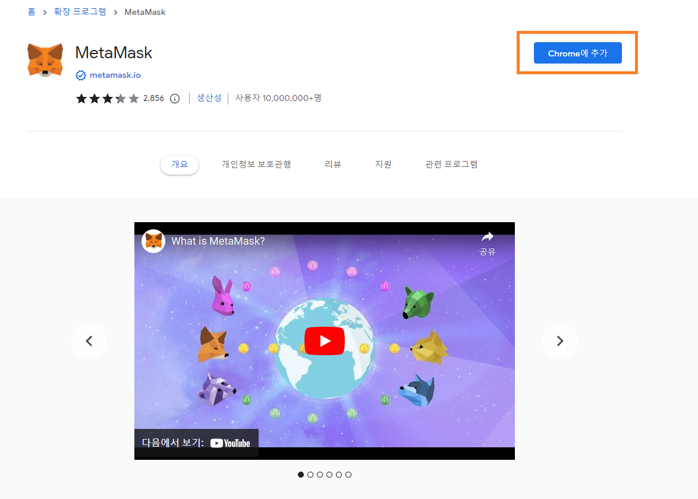

- 기존 지갑 가져오기 클릭 -> Agree 버턴 클릭
  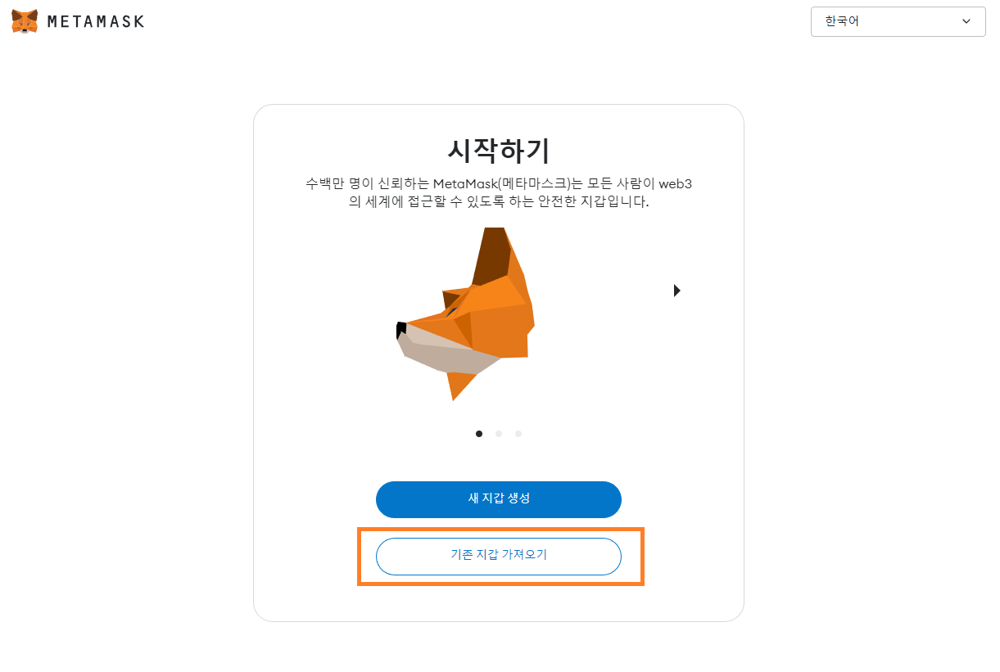

- .env 파일에 저장해 둔 MNEMONIC 단어 12개를 입력하고 비밀복구 구문확인 버턴 클릭
  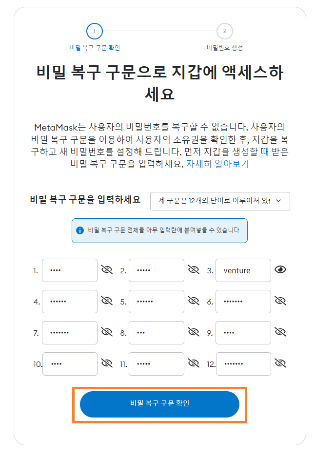

- 패스워드 입력하고 Metamask 어쩌구 CheckBox 클릭. 내 지갑 가져오기 클릭
  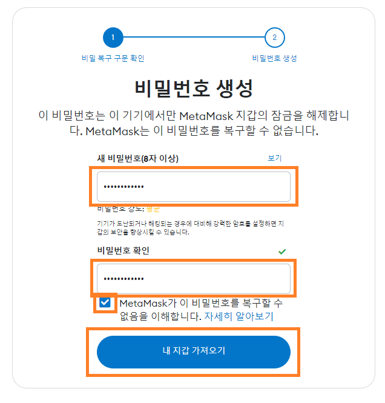

- Metamask 창 닫기

- 크롬 오른쪽 상단의 Extension 버턴을 클릭하고 항상 표시되도록 고정하기
  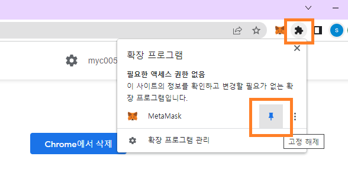

- Metamask 버턴을 클릭 후 Account 1을 클릭하여 주소를 클립보드로 복사하고 내 Public key와 같은지 확인
  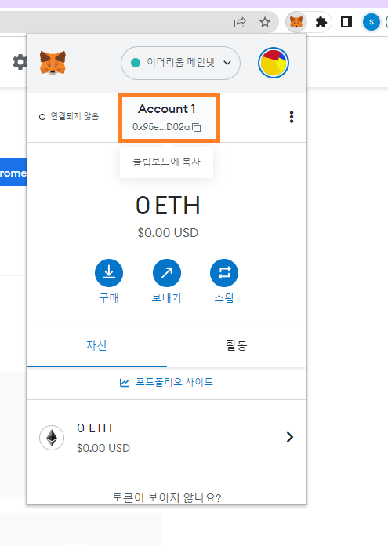

- 완료!!!!

# Edit My Collection

- Opensea에서 Metamask를 연결하고 Collection 정보를 수정해 보겠습니다.

- Collection은 한 NFT 컨트랙트에서 Mint된 NFT들의 모음입니다. 내 NFT의 홈페이지 같은 거라고 보시면 될 거 같습니다.

- 크롬에서 [Opensea testnet](https://testnets.opensea.io/)으로 이동

- Monkey NFT Collection 페이지로 이동 - 아직은 지갑연결을 하지 않았기 때문에 Edit (Collection) 버턴이 없음
    
    ```Opensea 상단 검색창에 내 Monkey contract address 입력하고 Enter key 누르기```

- Opensea 우측 상단의 지갑버턴 클릭
    
    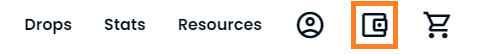

- Metamask 클릭

    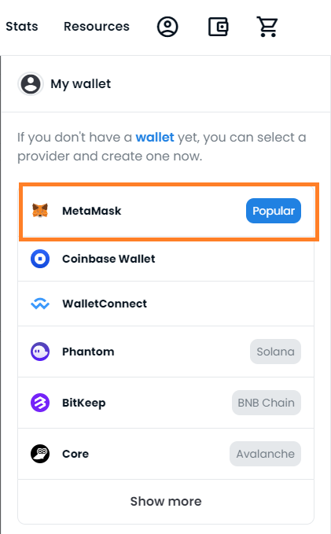

- 다음 클릭

  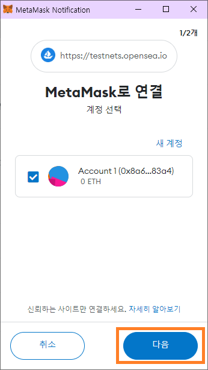

- 연결 클릭

    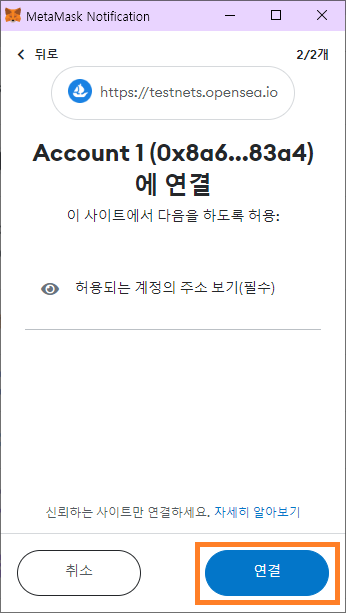

- Accept and Sign 클릭

    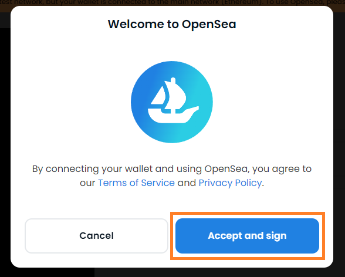

- 네트워크 추가 혹은 전환

    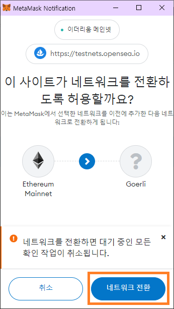

- 서명 클릭

    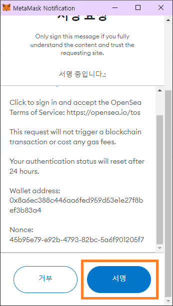

- :warning:Opensea에서 어떤 버턴을 눌러도 진행되지 않는다면 크롬 우측 상단 Metamask 버턴에 1 뱃지가 있는지 확인

    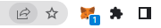

- Monkey Collection 페이지로 이동

- Edit 버턴 클릭. :warning: Edit버턴이 보이지 않는다면 Monkey NFT를 배포한 주소와 다른 주소를 사용하고 있다는 얘기입니다. Metamask의 현재 연결 계정을 확인해주세요
    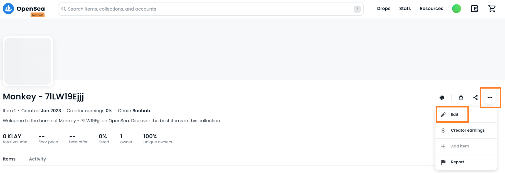

- Log image, Featured image

    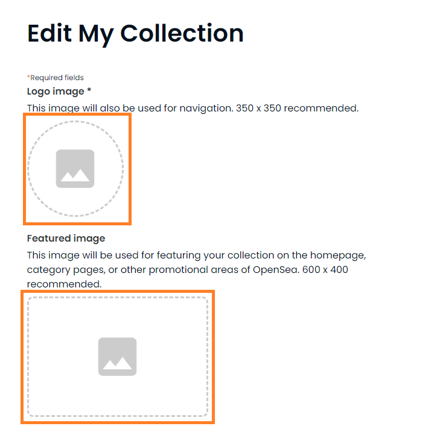

- Banner image, Name

    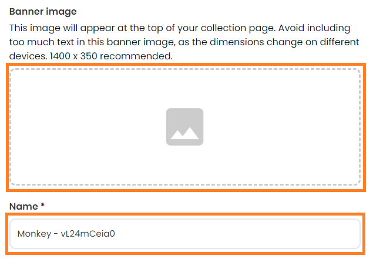

- Description, Category

    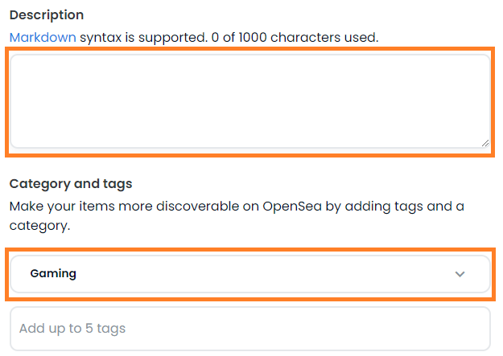

- Creator earnings

    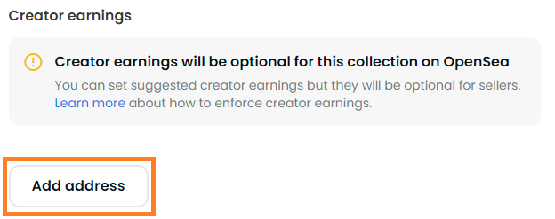

    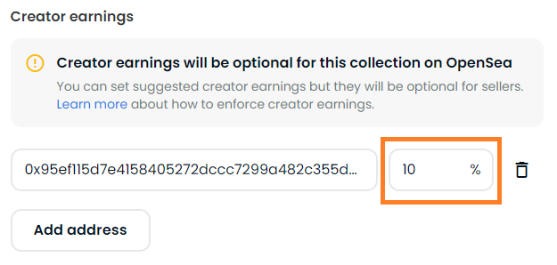

- Payment tokens

    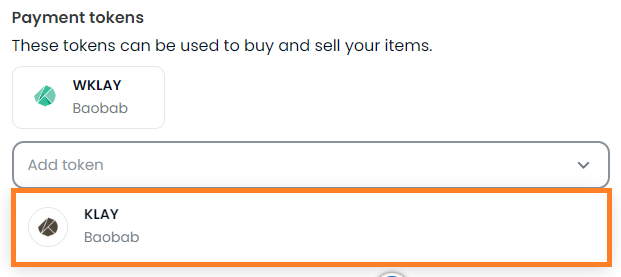

- Collaborators

    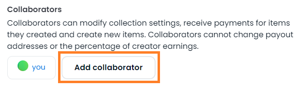

- Submit changes 버턴 클릭

- My Collection 확인

# Refresh Metadata

- Monkey NFT Contract의 train 함수를 호출하여 레벨을 변경하겠습니다.

- /src/monkey/train.ts 파일 추가

- train.ts 스크립트 만들기

    - <details><summary>⌨️ Source Code</summary>
    
        ```ts
        import hre, { ethers } from 'hardhat';
        import { getGasOption } from '../utils/gas';
        import * as fs from 'fs';
        import { Monkey } from '../../typechain';

        async function main() {
            const [admin] = await hre.ethers.getSigners();

            const chainId = hre.network.config.chainId || 0;

            const deployedContractJson = fs.readFileSync(
                __dirname + '/monkey.deployed.json',
                'utf-8',
            );
            const deployedContract = JSON.parse(deployedContractJson);
            const monkey = (await ethers.getContractAt(
                deployedContract.abi,
                deployedContract.address,
            )) as Monkey;

            const transaction = await monkey.train(1, getGasOption(chainId));
            await transaction.wait();
        }

        main()
        .then(() => process.exit(0))
        .catch(error => {
            console.error(error);
            process.exit(1);
        });

        ```
    
    </details>

- train.ts 실행

    ```
    npx hardhat run --network baobab .\src\monkey\train.ts
    ```

- Opensea에서 변경된 Metadata를 확인 해보면 아직 변경되지 않은 것을 알 수 있습니다. Opensea는 원활한 서비스를 위해 Metadata를 Caching하고 있는데요. Caching된 데이타가 아직 변경되지 않았기 때문입니다.

- Caching이라는 것은 보통 데이타의 접근이 더 빠른 저장소로 데이타를 카피하는 작업을 말합니다.

- force update 지원여부

    - 아래 API로 메타데이타를 강제로 업데이트 가능 하지만 Klaytn network는 지원하지 않습니다.
  
    - 현재 사용하시는 네트워크가 아래 API를 지원하는지 확인하세요.
  
    - Testnet
    
        ```
        https://testnets-api.opensea.io/api/v1/asset/0x556a47b6e5269a1287dc843f581ba8afd07fb062/1/?force_update=true
        ```

    - Mainnet
        ```
        https://api.opensea.io/api/v1/asset/0x556a47b6e5269a1287dc843f581ba8afd07fb062/1/?force_update=true
        ```

- Refresh metadata


    - Refresh metadata 버튼 클릭
        
        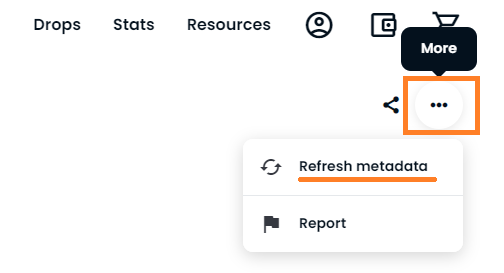

    - 잠시 뒤에 내 NFT의 화면을 Refresh 해보면 Metadata가 변경된 것을 확인할 수 있습니다.